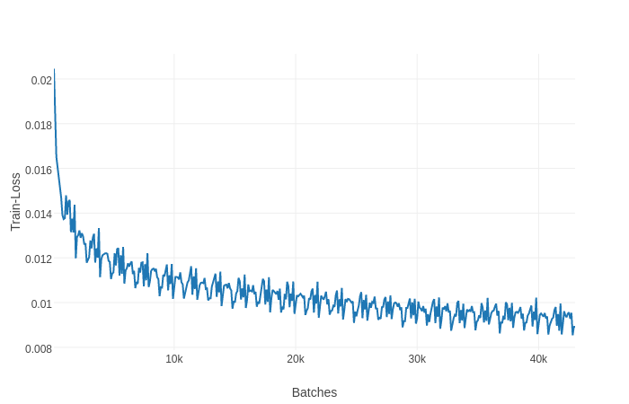
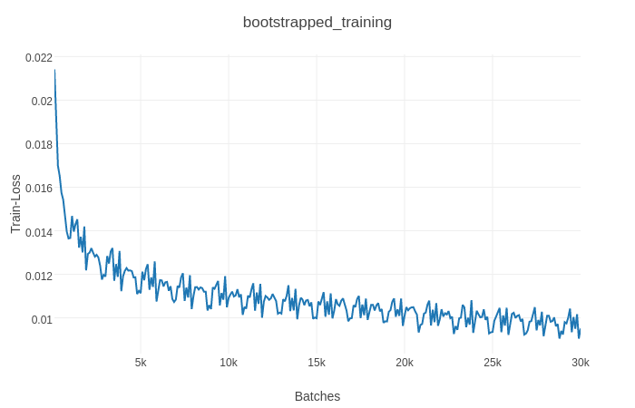

# Adaptive-Sentinel-Image-Captioning
Implementation of the [Knowing When to Look: Adaptive Attention via A Visual Sentinel for Image Captioning](https://arxiv.org/abs/1612.01887) by Lu et. al.

Work in Progress. 

### TO-DO : 
- [x] Implement normal LSTM-Attention
- [x] Greedy + Sampling Decoder
- [x] Layer Normalization
- [] Debug Sentinel-LSTM
- [] Implement Beam Search
- [] Tune hyperparameters

#### Train Loss curve without pre-trained embeddings

#### Train Loss curve with pretrained embeddings

Work in Progress. 

# Adaptive-Sentinel-Image-Captioning
Implementation of the 'Knowing When to Look: Adaptive Attention via A Visual Sentinel for Image Captioning' by Lu et. al.
